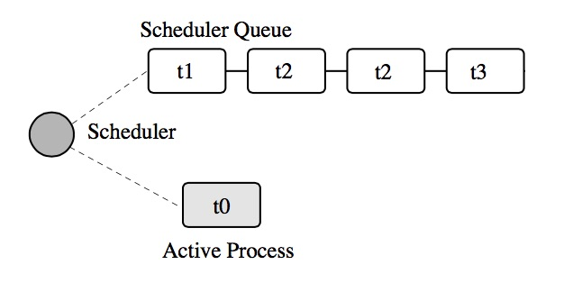
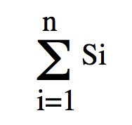
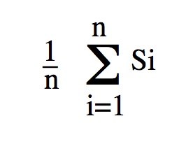
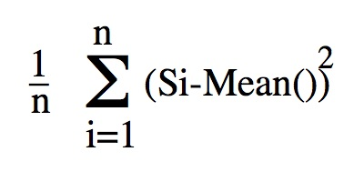

= JavaSim Manual Version 2.0
:numbered:

JavaSim is an object-oriented, discrete event simulation toolkit for Java. It's a Java implementation of the original link:http://www.cs.newcastle.ac.uk/publications/articles/papers/200.pdf[C++SIM simulation toolkit], which was developed as a direct consequence of research conducted within the scope of the link:http://www.ncl.ac.uk/computing/research/publication/159390[Arjuna project from Newcastle University] in the 1980's. Therefore, it shares many of the same requirements:

* easy to learn and use: the interface to the simulation library should be easy to understand.
* correct abstraction: existing Java programmers should not find the simulation paradigm in conflict with the programming paradigm presented by Java. Simulation programmers used to other environments should find the transition to JavaSim straightforward.
* flexible and extensible: it should be relatively easy for anyone to add new functionality to the system, such as new distribution functions.
* efficiency: the system should be efficient and produce efficient simulation runs. Simulation packages which we have experience of tended to be extremely slow and consume large amounts of system resources.

These requirements were realised in the following design decisions:

- the discrete-event process based simulation facilities provided by SIMULA and its simulation classes and libraries have a considerable experience and user community which have found them to be successful for a wide variety of simulations. In later versions of the system additional simulation classes were added which provide extra functionality.

- inheritance was to be used throughout the design to even a greater extent than is already provided in SIMULA. This enables JavaSim to be more flexible and extensible, allowing new functionality to be added without affecting the overall system structure. For example, our I/O facilities, random number generators and probability distribution functions are entirely object-oriented, relying on inheritance to specialise their behaviour.

NOTE: It is not necessary for the reader to know anything about the SIMULA programming language or its simulation classes, but such knowledge would aid in the understanding of the concepts and classes presented within.

Currently JavaSim has been tested with JDK 1.7 and 1.8. In the past it has worked with all versions of Java starting with 1.0.2. However, we have not tested with older versions for a long time, so your mileage may vary. If you have any problems, questions, suggestions etc. then consider raising an issue on the link:https://github.com/nmcl/JavaSim/issues[github page] or even fork JavaSim and raise a pull request.

== Introduction

This manual is not intended as a tutorial on the concepts of simulation in general, but rather how to write simulations in the JavaSim system. However, in order to be able to do this certain key simulation concepts will be briefly described. The interested reader is referred to link:http://dl.acm.org/citation.cfm?id=539335[this book] for detailed descriptions of these concepts and for further discussions on simulation modelling.

=== Simulation Models

To model a system is to replace it by something which is:

- simpler and/or easier to study. 

- equivalent to the original in all important respects. 

Therefore, before constructing the actual simulation, it is first necessary to abstract from the real system those components and their interactions that are considered important for the actual model. Building a simulation system model involves making certain simplifying assumptions to aid in the actual implementation and study of the simulation (without such simplifications the model would be as complex as the system it is meant to be simulating). However, the accuracy of the results obtained from the simulation depend upon how valid the initial assumptions are. For example, when considering the trajectory of a projectile through the atmosphere, the friction due to the air molecules is usually ignored. This assumption is valid only within certain boundaries: if the size of the projectile is on the same scale as the air molecules and its speed is sufficiently small then friction plays a significant role in its movement.

Thus, the first step towards building a simulation model of a system is to determine exactly what are the important features which are to be measured, and what characteristics of the system have an affect on them. Any boundary conditions for the simulation (e.g., size of projectile) should be considered at the same time in order to simplify this procedure. Building a final model can often take several phases, where results from the initial model are compared with those obtained from the real system to determine their accuracy. Any discrepancies are taken into account by possibly adding new components to the simulation until, within certain error boundaries, the simulation results match those from the real system.

=== Terminology

The system components chosen for the simulation are termed simulation entities. Associated with each _entity_ in the simulation are zero or more _attributes_ that describe the state of the entity and which may vary during the course of the simulation. The interaction of entities and the changes they cause in the system state are termed _events_.

The collection of these component attributes at any given time _t_ defines the system state at _t_. In general, the system state can take any of a variety of values, and a given simulation run results in one realisation of a set of these values (the _operation path_) over the _observation period_.

=== Categories of simulation models

There are three categories of simulation model, described by the way in which the system state changes as a function of time:

- _Continuous time_: is one whose state varies continuously with time; such systems are usually described by sets of differential equations. 

- _Discrete time_: the system is considered only at selected moments in time (the observation points). These moments are typically evenly spaced. Some economics models are examples of this, where economics data becomes available at fixed intervals. Changes in state are noticed only at observation points. By choosing a suitably small interval between observation points, a continuous time simulation can be approximated by a discrete time simulation. 

- _Continuous time-discrete event_: the time parameter is (conceptually) continuous and the observation period is a real interval, usually starting at zero for simplicity. The operation path is completely determined by the sequence of event times (which need not be evenly spaced and can be of arbitrary increments) and by the discrete changes in the system state which take place at these times (i.e., the interactions of the events). In between consecutive event times the system state may vary continuously. Although it is possible to model the passage of real time by suitable event timing, this is not necessary for a discrete event system: the simulation model can advance its own internal time directly from one discrete event to another, taking any appropriate action to advance the state accordingly. 

It is this latter category of simulation modelling that JavaSim supports. Examples of discrete-event simulations are most queuing problems: entities (e.g., customers in a bank) arrive according to a given distribution and change the system state instantaneously (e.g., the number of customers in the queue). The operation paths for this system are step functions: they jump up (or down) by one when a customer joins (or leaves) the queue.

=== Event scheduling

Given that a simulation consists of a series of interacting events (the operation path), a simulator can be defined as that program devoted to the generation of operation paths. The simulator allows the creation of events and controls their interactions according to a set of rules, using an internal “clock” to keep track of the passage of (simulation) time.

It maintains an _event list_, which indicates which events are to be scheduled for execution at specific simulation times. Events are executed according to their simulation times. There are two approaches to the way in which a simulator can schedule events to produce an operation path:

- _event-oriented_: there is a procedure associated with each type of event in the system: it performs the action required to handle that type of event and it is invoked every time such an event occurs. In an event-oriented approach, an operation path is obtained by taking a global view of everything that happens in the system; the manipulation of events is explicit. 

- _process-oriented_: an operation path is obtained by the interacting of a number of processes running in parallel. The management of events is implicit in the management of the processes. The simulation system provides primitives for placing processes at particular points on the event list, removing and re-scheduling them. 
The JavaSim User’s Manuals

The process-oriented approach best fits with the object-oriented paradigm which we want to present to the programmer of JavaSim. As in SIMULA, simulation processes then become active objects which interact with each other through message passing and the simulation primitives. Refinements of these objects can then be obtained by inheriting from them and redefining the appropriate methods.

== Basic simulation classes

This section describes the core elements of the JavaSim simulation system. It is not intended as a tutorial on Java, and basic knowledge of the language is assumed. Note, all of the classes described in this section can be found in the org.javasim package.

=== The simulation scheduler

The previous section described the event list and how simulation entities (processes) are executed according to their position on the event list (i.e., with increasing simulation time). In JavaSim, as in SIMULA, simulation processes are managed by a _scheduler_ and are placed on a _scheduler queue_ (the event list). Processes are executed in pseudo-parallel, i.e., only one process executes at any instance of real time, but many processes may execute concurrently at any instance of simulation time. The simulation clock is only advanced when all processes have been executed for the current instance of simulation time.

Inactive processes are placed on to the scheduler queue, and when the current active process yields control to the scheduler (either because it has finished or been placed back onto the scheduler queue), the scheduler removes the process at the head of the queue and re-activates it. (In SIMULA the currently active process is not removed from the head of the queue.) When the scheduler queue is empty, i.e., there are no further processes left to execute, the scheduler terminates the simulation.

Figure 1: Scheduler-Process Interaction

As Figure 1 shows, the scheduler co-ordinates the entire simulation run, effectively monitoring the active and passive processes to enable it to determine when, and which, process to activate next. A simulation application cannot affect the scheduler directly, but can do so only indirectly through modifications of the scheduler queue.

NOTE: the scheduler queue can be structured in a variety of ways, including a linear list or a tree. The implementation of the queue can depend upon the type of simulation being conducted. For example, a simulation which involves many (concurrent) processes would suffer from using a linear ordered queue which would typically have insertion and removal routines with overheads proportional to the number of entries in the queue. However, a linear list may work best for a low number of simulation processes. JavaSim comes with a suite of scheduler queue implementations which can be chosen when the system is built.

==== Scheduler and Simulation classes

The simulation scheduler is an instance of the Scheduler class. It is the responsibility of the application programmer to ensure that only a single instance of this class is created.

NOTE: In recent versions of JavaSim the Simulation class has taken on some of the functionality previously incorporated within the Scheduler class.

----
public class Scheduler extends Thread
{
    public static double currentTime ();
}
----

The scheduler maintains the simulation clock, and the current value of this clock is obtained by invoking the CurrentTime() method.

----
public class Simulation
{
    public static synchronized void reset () throws SimulationException;
    
    public static synchronized boolean isReset ();
    
    public static synchronized void stop ();
    
    public static synchronized void start ();
}
----

To enable multiple simulation runs to occur within a single application, it is possible to reset it and the simulation clock by calling the reset() method of the Simulation class. This causes the simulation to remove all processes (simulation objects) currently registered on the scheduler queue and to invoke a class specific method on each of them which resets their states (detailed in the next section). Once this is finished the simulation is ready for an additional run. A suspended process is informed that it has been “reset” by having the method it called to originally suspend itself (i.e., place itself on the scheduler queue) raise the RestartSimulation exception, which the object should catch. It must then perform any work necessary to put itself back in a state ready for restarting the simulation, and should then suspend itself again before the simulation can be restarted (typically by calling cancel.)

A process can use isReset to determine whether or not the simulation has been reset. The start and stop operations allow the simulation to be halted or resumed respectively.

=== Simulation processes

As was described in the previous sections, JavaSim supports the process-oriented approach to simulation, where each simulation entity can be considered a separate process. Therefore in JavaSim the entities within a simulation are represented by _process objects_. These are Java objects which have an independent thread of control associated with them at creation time, allowing them to convey the notion of activity necessary for participating in the simulation.

In keeping with the object-oriented paradigm, and to make development of process objects simpler, classes inherit the process functionality from the appropriate base class (SimulationProcess). This class defines all of the necessary operations for the simulation system to control the simulation entities within it, and for them to interact with it and each other.

At any point in simulation time, a process can be in one (and only one) of the following states:

- _active_: the process has been removed from the head of the scheduler queue and its actions are being executed. 

- _suspended_: the process is on the scheduler queue, scheduled to become active at a specified simulation time. 

- _passive_: the process is not on the scheduler queue. Unless another process brings it back on to the queue it will not execute any further actions.

- _terminated_: the process is not on the scheduler queue and has no further actions to execute. Once a process has been terminated it cannot be made to execute further in the same simulation run. 

A process which is either active or suspended is said to be _scheduled_.

==== SimulationProcess class

The SimulationProcess class definition is shown below. Before considering how to build an example class derived from SimulationProcess we shall discuss the methods which it provides.

Because the constructors are protected, it is not possible to create an instance of the SimulationProcess class, i.e., classes must be derived from this. Processes are threaded objects, and typically each thread package schedules execution of threads according to a priority. By default, all processes in JavaSim are created with the same priority, but this can be altered by calling the setPriority method of java.lang.Thread.

NOTE: Thread priorities have no effect on a simulation run.

----
public class SimulationProcess extends Thread
{
    public final double time ();
    public synchronized SimulationProcess nextEv () throws SimulationException, NoSuchElementException;
    public final double evtime ();
    public void activateBefore (SimulationProcess p) throws SimulationException, RestartException;
    public void activateAfter (SimulationProcess p) throws SimulationException, RestartException;
    public void activateAt (double AtTime, boolean prior) throws SimulationException, RestartException;
    public void activateAt (double AtTime) throws SimulationException, RestartException;
    public void activateDelay (double Delay, boolean prior) throws SimulationException, RestartException;
    public void activate () throws SimulationException, RestartException;
    public void reactivateBefore (SimulationProcess p) throws SimulationException, RestartException;
    public void reactivateAfter (SimulationProcess p) throws SimulationException, RestartException;
    public void reactivateAt (double AtTime, boolean prior) throws SimulationException, RestartException;
    public void reactivateAt (double AtTime) throws SimulationException, RestartException;
    public void reactivateDelay (double Delay, boolean prior) throws SimulationException, RestartException;
    public void reactivateDelay (double Delay) throws SimulationException, RestartException;
    public void reactivate () throws SimulationException, RestartException;
    public void cancel () throws RestartException;
    public void terminate ();
    public synchronized boolean idle ();
    public boolean passivated ();
    public boolean terminated ();
    public static SimulationProcess current () throws SimulationException;
    public static double currentTime ();
    public static void mainSuspend ();
    public static void mainResume () throws SimulationException;
    
    protected void hold (double t) throws SimulationException, RestartException;
    protected void passivate () throws RestartException;
    protected void setEvtime (double time) throws SimulationException;
    protected void suspendProcess () throws RestartException;
    protected void resumeProcess ();
}
----

There are five ways to activate a currently passive process, which results in it being brought to the correct position in the scheduler queue corresponding to its associated simulation time. If this is the head of the queue then it will become the active process.

- activate(): this activates the process at the current simulation time. 

- activateBefore(SimulationProcess proc): this positions the process in the scheduler queue before proc, and gives it the same simulation time. If proc is not present then a SimulationException will be thrown. 

- activateAfter(SimulationProcess proc): this positions the process in the scheduler queue after proc, and gives it the same simulation time. If proc is not present then a SimulationException will be thrown. 

- activateAt(double AtTime, boolean prior): the process is inserted into the scheduler queue at the position corresponding to the simulation time specified by AtTime. The default for this time is the current simulation time. The prior parameter is used to determine whether this process should be inserted before or after any processes with the same simulation time which may already be present in the queue. The default is false. 

- activateDelay(double AtTime, boolean prior): the process is activated after a specified delay (AtTime). The process is inserted into the queue with the new simulation time, and the prior parameter is used to determine its ordering with respect to other processes in the queue with the same time. The default is false. 

There are correspondingly five reActivate methods, which work on either passive or scheduled processes. These will not be described in detail as they have similar signatures to their Activate counterparts and work in the same way.

- hold(double period) schedules the currently active process for re-activation after the simulated delay of period time. If this is invoked by the object (e.g., through a publicly available method) when it is not the current active process then it does nothing.

- evtime() returns the time at which the process is scheduled for activation.

- nextEv() returns a reference to the next process to be scheduled for execution. If the queue is empty then null is returned.

The static method current() returns a reference to the currently active process.

The current simulation time can be obtained by using either the currentTime() or time() methods. The former method is static and as such can be invoked without an instance of the SimulationProcess class.

cancel() removes the process from the scheduler queue or suspends it if it is the currently active process. In either case, the process is set to the passive state. passivate() functions similarly but only works on the currently active process, i.e., if it is invoked by the object (e.g., through a publicly available method) when it is not the current active process then it does nothing.

terminate() removes the process from the scheduler queue or it is suspended if it is currently active. The process is then set to the terminated state, and can take no further part in this simulation run.

idle() returns false if the process is either active or scheduled to become active. Otherwise true is returned.

passivated() and terminated() indicate whether the process is in the passive or terminated state, respectively.

Because SimulationProcess extends the java.lang.Thread class it is necessary for the simulation class to provide an implementation of the run method which will do the actual work for the process. If this method ever returns then the thread is destroyed. However, in order for JavaSim to detect the termination of the thread, the terminate() method _must_ be used instead.

===== Example

To illustrate how a simulation process could be implemented from the Process class we shall consider the example of a queue of customers arriving at a bank. For this example, this involves three classes:

- Customer: instances of this class represent the customers in the queue. 

- Queue: the instance of this class (queue) is the queue into which customers are places. 

- Arrivals: this is the process which creates new customers for insertion in queue. 

The implementations of the Customer and Queue classes are not important to this example. The implementation of the Arrivals class could be:

----
class Arrivals extends SimulationProcess
{
    public void run ()
    {
        for  (;;)
        {
            Customer c = new Customer();
            
            queue.insert(c);
            hold(20.0);
        }
    }
}
----

=== Starting, ending and controlling a simulation

When a SimulationProcess object is created in JavaSim it starts in the passive state, and must be activated before it can take part in the simulation. This is typically performed by the first process object to which control is transferred after the simulation is initially started. When writing JavaSim applications it is typical for the main thread to create a single _controller process_ which is responsible for co-ordinating the entire simulation run. This creates and activates all of the simulation entities and the scheduler, and provides methods for suspending the main thread, thus allowing the controller object to execute, and exiting the application. An example controller interface is shown below, and the implementations for its methods will be described in the following sections:

----
public  class  Controller  extends  SimulationProcess
{
    public  void  run  ();

    public void await ();
    public void exit (); 
}
----

Because Controller is a simulation process itself, it derives from Simulationrocess and defines a run() method, which will do the actual controlling of the simulation. It also provides the following methods:

- await(): this method is called within the main application thread and suspends it, effectively transferring control the Controller process. 

- exit(): this method is called to exit the simulation. 

==== Suspending the main thread

When a threaded application is started it is important to realise that before any application threads are created, the Java virtual machine has already created one to run the application. This thread must be suspended before any simulation threads can run.

The await() method of Controller is responsible for suspending this thread:

----
public  void  await  ()
{
    resume();
    
    SimulationProcess.mainSuspend();
}
----

It must first resume the thread associated with the Controller instance (since Controller is a SimulationProcess it starts in the passive state). This thread does not execute until the main thread is suspended by the call to the static mainSuspend method.

The code for main would then become:

----
public  static  void  main  (String[]  args)
{
    Controller c = new Controller(); c.await();
}
----

==== Exiting the application

In order to exit a simulation application, the application can call System.exit. However, if it is only necessary to resume the main thread, then this can be accomplished by using the static mainResume method of the SimulationProcess class. Once the main thread has been resumed, it will continue to execute from the point it was suspended. In the example above, this would be from within the await method. The thread which calls mainResume can then suspend or terminate itself, depending upon the application requirements.

----
public  void  exit  ()
{
    if  (resumeMainRequired)
    {
        SimulationProcess.mainResume();
        
        suspend();
    }
    else
        System.exit(0);
}
----

==== Controlling the simulation

The controller’s body creates and activates the other simulation entities and the scheduler, and controls the overall simulation (e.g., resetting the system between consecutive runs).

----
public  void  run  ()
{
    sc  =  new  Scheduler();

    //  create  and  activate  any  other  simulation  entities

    sc.resume();    //  we  must  create  a  scheduler  for  the  simulation  to  run execute  the  simulation 
    
    // print  results 

    sc.Suspend(); // suspend scheduler 
    
    // suspend simulation entities

    mainResume();
}
----

The final call to mainResume prevents run() from exiting, which we must do to ensure the application is portable between thread implementations.

=== Resetting a simulation

Resetting a simulation involves resetting all of the objects involved in it which will be required for subsequent runs. When the reset method is invoked on the Scheduler, this causes the current simulation run to be terminated, and all simulation objects which are currently suspended on the scheduler queue will be woken and the RestartException will be thrown to each. Any objects which are required to participate within a new simulation run must catch this exception, reset themselves to a state consistent with the start of another simulation, and then become suspended, to await the restart of the simulation.

==== Example

If we take the Arrivals example above and add a reset method then the code could be:

----
public  class  Arrivals  extends  SimulationProcess
{
    public  void  run  ()
    {
        for  (;;)
        {
            try
            {
                for  (;;)
                {
                    Customer c = new Customer(); queue.insert(c);

                    hold(20.0);
                }
            }
            catch  (RestartException  e)
            {
            }
        }
        }
}
----

== Distribution Functions

Many of the aspects of the real world which a simulation attempts to model have properties which correspond to various distribution functions, e.g., inter-arrival rates of customers at a bank queue. Therefore, simulation studies require sources of random numbers. Ideally these sources should produce an endless stream of such numbers, but to do so either requires specialised hardware or the ability to store an infinite (large) table of such numbers generated in advance.

Without such aids, which are either impractical or not generally available, the alternative is to use numerical algorithms. No deterministic algorithm can produce a sequence of numbers that would have all of the properties of a truly random sequence (see link:http://www.amazon.com/Art-Computer-Programming-Volume-Seminumerical/dp/0201896842[Knuth, Volume 2.]) However, for all practical purposes it is only necessary that the numbers produced appear random, i.e., pass certain statistical tests for randomness. Although these generators produce pseudo-random numbers, we continue to call the random number generators.

The starting point for generating arbitrary distribution functions is to produce a standard uniform distribution. As we shall see, all other distributions can be produced based upon this. (Interested readers are referred to link:http://dl.acm.org/citation.cfm?id=539335[this] for a more complete treatment of this topic). All of the distribution functions in JavaSim rely upon inheritance to specialise the behaviour obtained from the uniform distribution class. These classes can be found in the org.javasim.streams package.

=== RandomStream

The actual uniform distribution class is called RandomStream. This returns a series of random numbers uniformly distributed between 0 and 1. We experimented with several random number generators before settling on a shuffle of a multiplicative generator with a linear congruential generator, which provides a reasonably uniform stream of pseudo-random numbers.

----
public  abstract  class  RandomStream
{
    public abstract double getNumber () throws IOException, ArithmeticException;

    public  final  double  error  ();

    protected  RandomStream  ();
    protected  RandomStream  (long  MGSeed,  long  LCGSeed);

    protected final double uniform (); 
}
----

The multiplicative generator uses the following algorithm:

Y[i+1] = Y[i] * 5^5^ mod 2^26^

, where the period is 2^24^, and the initial seed must be odd (Thanks to Professor I. Mitrani for his help in developing this.)

The uniform() method uses the linear congruential generator (seed is LCGSeed, with the default value of 1878892440L) based on the algorithm in link:http://algs4.cs.princeton.edu/home/[this text], and the results of this are shuffled with the multiplicative generator (seed is MGSeed, with a default value of 772531L) as suggested by link:http://www.amazon.com/Art-Computer-Programming-Volume-Seminumerical/dp/0201896842[Maclaren and Marsaglia], to obtain a sufficiently uniform random distribution, which is then returned.

The error() method returns a chi-square error measure on the uniform distribution function.

By abstract method getNumber must be provided by derived classes, and is used to obtain a uniform means of accessing random numbers.

The  RandomStream class  returns  a  large  sequence  of  random  numbers,  whose  period  is 2^24^. However, unless the seeds are modified when each random distribution class is created, the starting position in this sequence will always be the same, i.e., the same sequence of numbers will be obtained. To prevent this, each class derived from RandomStream has an additional parameter for one of its constructors which indicates the offset in this sequence from which to begin sampling.

=== UniformStream

The UniformStream class inherits from RandomStream and returns random numbers uniformly distributed over a range specified when the instance is created.

----
public  class  UniformStream  extends  RandomStream
{
    public  UniformStream  (double  lo,  double  hi);
    public UniformStream (double lo, double hi, int StreamSelect);
    public UniformStream (double lo, double hi, int StreamSelect, long  MGSeed,  long  LCGSeed);

    public double getNumber () throws IOException, ArithmeticException;
};
----

The range covers the interval specified by lo and hi. StreamSelect indicates the offset in the random number sequence to begin sampling, and MGSeed and LCGSeed can be used to modify the seed values used by the RandomStream class.

=== ExponentialStream

The ExponentialStream class returns an exponentially distributed stream of random numbers with mean value specified by mean.

----
public  class  ExponentialStream  extends  RandomStream
{
    public  ExponentialStream  (double  mean);
    public ExponentialStream (double mean, int StreamSelect); 
    public ExponentialStream (double mean, int StreamSelect, long  MGSeed,  long  LCGSeed);

    public double getNumber () throws IOException, ArithmeticException; 
};
----

StreamSelect indicates the offset in the random number sequence to begin sampling, and MGSeed and LCGSeed can be used to modify the seed values used by the RandomStream class.

=== ErlangStream

ErlangStream returns an erlang distribution with mean mean and standard deviation sd.

----
public  class  ErlangStream  extends  RandomStream
{
    public  ErlangStream  (double  mean,  double  sd);
    public ErlangStream (double mean, double sd, int StreamSelect); 
    public ErlangStream (double mean, double sd, int StreamSelect, long  MGSeed,  long  LCGSeed);

    public double getNumber () throws IOException, ArithmeticException; 
};
----

StreamSelect indicates the offset in the random number sequence to begin sampling, and MGSeed and LCGSeed can be used to modify the seed values used by the RandomStream class.

=== HyperExponentialStream

The HyperExponential class returns a hyper-exponential distribution of random numbers, with mean mean and standard deviation sd.

----
public  class  HyperExponentialStream  extends  RandomStream
{
    public  HyperExponentialStream  (double  mean,  double  sd);
    public HyperExponentialStream (double mean, double sd, int StreamSelect); 
    public HyperExponentialStream (double mean, double sd, int StreamSelect, long  MGSeed,  long  LCGSeed);

    public double getNumber () throws IOException, ArithmeticException; 
};
----

StreamSelect indicates the offset in the random number sequence to begin sampling, and MGSeed and LCGSeed can be used to modify the seed values used by the RandomStream class.

=== NormalStream

NormalStream returns a normal distribution of random numbers, with mean mean and standard deviation sd. operator() uses the polar method due to link:http://www.amazon.com/Art-Computer-Programming-Volume-Seminumerical/dp/0201896842[Box, Muller, and Marsaglia.]

----
public  class  NormalStream  extends  RandomStream
{
    public  NormalStream  (double  mean,  double  sd);
    public NormalStream (double mean, double sd, int StreamSelect); 
    public NormalStream (double mean, double sd, int StreamSelect, long  MGSeed,  long  LCGSeed);

    public double getNumber () throws IOException, ArithmeticException; 
};
----

StreamSelect indicates the offset in the random number sequence to begin sampling, and MGSeed and LCGSeed can be used to modify the seed values used by the RandomStream class.

=== Draw

The Draw class is the exception to the inheritance rule, instead using RandomStream through delegation (for historical reasons). This returns true with the probability prob, and false otherwise.

----
public  class  Draw
{
    public  Draw  (double  p);
    public  Draw  (double  p,  int  StreamSelect);
    public  Draw  (double  p,  int  StreamSelect,  long  MGSeed,  long  LCGSeed);

    public boolean getBoolean () throws IOException; 
};
----

StreamSelect indicates the offset in the random number sequence to begin sampling, and MGSeed and LCGSeed can be used to modify the seed values used by the RandomStream class.

=== Example

TODO

== Advanced Simulation Classes

Simulations formed by the interaction of objects derived from SimulationProcess can be considered _causal_ (synchronous) in nature: events occur at specific times and form a well defined order. However, it is sometimes necessary to simulate asynchronous real world events, e.g., processor interrupts. To do this requires finer-grained control of the scheduling of simulation processes than it provided by the scheduler; the scheduler simply activates according to simulation time, whereas asynchronous events may have different activation rules, e.g., activate when another process is terminated.

The SimulationEntity class and others to be described in the following sections gives this required level of control to the user, extending the types of simulation which are possible with JavaSim. Asynchronous simulation processes are derived from SimulationEntity, but the implementation enables these asynchronous process to execute in the same simulation as SimulationProcess objects. However, because these processes are suspended and resumed outside of the control of the scheduler, it is possible for deadlock situations to occur. Therefore, some care must be taken when using these classes.

In addition to the active, suspended, passive and terminated states which a simulation process can be in, asynchronous objects can also be in the following states:

- _waiting_: the process is suspended waiting for a specific event to occur (e.g., a process to be terminated). The waiting process is _not_ placed on the scheduler queue.

- _interrupted_: the process, which was in the waiting state, has been interrupted from this before the condition it was awaiting occurred. 

The conditions on which a process can wait, and can thus be interrupted from, are:

- _time_: a process can attempt to wait for a specified period of simulation time. 

- _process termination_: a process can wait for the termination of another SimultionEntity process before continuing execution. 

- _semaphore_: critical regions of a simulation can be protected by semaphores, where only a single Entity process can acquire the semaphore; other processes are suspended until the semaphore is released. 

- _user specific_: it is possible for other asynchronous conditions to occur which are not covered above.

The classes to be described in this chapter can be found in the org.javasim package.

=== Asynchronous entities

----
public  class  SimulationEntity  extends  SimulationProcess
{
    public void Interrupt (SimulationEntity toInterrupt, boolean immediate) throws SimulationException, RestartException;

    public final void trigger (); 
    public void terminate ();

    protected void timedWait (double waitTime) throws SimulationException, RestartException, InterruptedException;

    protected void waitFor (SimulationEntity controller, boolean reAct) throws SimulationException, RestartException, InterruptedException;
    protected void waitFor (SimulationEntity controller) throws SimulationException, RestartException, InterruptedException;

    protected void waitForTrigger (TriggerQueue  _queue) throws SimulationException, RestartException, InterruptedException;

    protected void waitForSemaphore (Semaphore _sem) throws RestartException; 
};
----

Because SimulationEntity is derived from SimulationProcess, all of the usual simulation methods are available, and can be used in conjunction with those provided by the derived class.

interrupt(SimulationEntity toInterrupt, boolean immediate) interrupts the asynchronous process toInterrupt, which _must_ not be *terminated* and _must_ be in the *waiting* state. toInterrupt becomes the next active process (i.e., it is moved to the head of the scheduler queue). If immediate is true then the current process is suspended immediately; it is scheduled for reactivation at the current simulation time. Otherwise, the current process continues to execute and can be suspended later in an application specific way.

Because it is now possible for one process to wait for another to terminate the terminate() method must differ from that provided by SimulationProcess. Before the terminating process ends it moves the waiting process to the head of the scheduler queue, and then calls SimulationProcess.terminate(). Currently only a single process can wait on this termination condition, but this may change in future versions.

wait(double t) is similar to hold(double t), with the exception that the process is moved into the *waiting* state as well as being placed on the scheduler queue. It is therefore possible to interrupt this process before the wait period has elapsed. true is returned if the process was interrupted, otherwise false is returned.

waitFor(SimulationEntity controller, boolean reAct) suspends the current process until controller has terminated. The process is placed in the *waiting* state. If reAct is true then controller is moved to the head of the scheduler queue to become the next activate process, otherwise (the default behaviour) the application will have to activate controller. If the waiting process is interrupted then the method returns true, otherwise false. The controller and the current process must be different, i.e., it is not possible for a process to wait for itself.

_Trigger queues_ are lists maintained by the simulation system of process waiting for specific events to occur, which are outside the scope of those described above. These will be described in the next section. waitForTrigger(TriggerQueue queue) places the current process on the trigger queue and passivates it. As with the previous methods, the return value indicates whether the process was interrupted, or triggered.

In addition to trigger queues, process can wait on semaphores, allowing the creation of monitor regions, for example. waitForSemaphore(Semaphore sem) causes the current process to attempt to exclusively acquire the semaphore. If this is not possible then the process is suspended. Currently, a process which is waiting on a semaphore cannot be interrupted, and is not placed into the *waiting* state. As such, when this method returns the semaphore has been acquired.

=== Trigger queues

Processes waiting for the same application controlled event can be grouped together into a TriggerQueue, as described in the previous section. When this event occurs the application can use one of the two trigger methods to activate the queue members. This involves placing the process(es) onto the head of the scheduler queue.

----
public  class  TriggerQueue
{
    public TriggerQueue ();

    public synchronized void triggerFirst (boolean  setTrigger) throws NoSuchElementException; 
    public synchronized void triggerFirst () throws NoSuchElementException;

    public synchronized void triggerAll () throws NoSuchElementException; 
};
----

- triggerAll(): triggers all of the members on the queue. 

- triggerFirst(boolean setTrigger): triggers only the head of the queue. If setTrigger is true (the default behaviour) then the trigger() method of the SimulationEntity object is also invoked. 

If the queue is not empty when it is garbage collected by the virtual machine then all remaining queue members will be triggered, and placed back onto the scheduler queue.

=== Semaphores

Application code can be protected from simulation processes through semaphores, which are instances of the Semaphore class.

----
public  class  Semaphore
{
    enum Outcome { DONE, NOTDONE, WOULD_BLOCK };

    public Semaphore  ();
    public Semaphore  (long number);

    public synchronized long numberWaiting  ();

    public synchronized Outcome get (SimulationEntity toWait) throws RestartException; 
    
    public synchronized Outcome tryGet (SimulationEntity toWait) throws RestartException;

    public synchronized Outcome release (); 
};
----

A semaphore can be used to restrict the number of processes which can use shared resources. The number of shared resources available must be presented to the Semaphore when it is created. By default, a Semaphore will assume that there is only a single resource, in which case a semaphore is exclusively acquired by a simulation process. However, it is possible to create a Semaphore with different resource counts.

A Semaphore can exist in one of two states:

- _available_: the semaphore is available to be acquired. 

- _unavailable_: a process (or number of processes) currently has the semaphore. If another process attempts to acquire the semaphore then it is automatically suspended until the semaphore is *available*, i.e., until a resource has been freed. 

To be able to manipulate semaphores a process must be derived from the SimulationEntity class. To obtain the semaphore, the get(SimulationEntity toWait) method should be used, where toWait is the calling process. If the semaphore is *unavailable* then the process referenced by toWait is suspended. If the semaphore is successfully acquired, then Outcome.DONE is returned, otherwise Outcome.NOTDONE.

If the process wishes to attempt to acquire the semaphore but does not want to block in the situation where the semaphore is currently unavailable, then it can use the tryGet method, which takes the same parameter as get. However, unlike get, tryGet will return Outcome.WOULD_BLOCK in the case where the caller would normally block if it had called get, i.e., the semaphore is currently in use. If the semaphore is not being used, then tryGet will acquire it for the caller. Errors will result in Outcome.NOT_DONE being returned.

When the semaphore is no longer required release() should be called by the process which currently has it. Successful release of the semaphore results in Outcome.DONE being returned, otherwise Outcome.NOTDONE is returned.

numberWaiting() returns the number of processes currently suspended waiting for the semaphore.

If the semaphore is garbage collected with processes waiting for it then an error message is displayed. No further action is attempted on behalf of these waiting processes.

=== Example

== Statistical classes

The purpose of a simulation typically involves the gathering of relevant statistical information, e.g., the average length of time spent in a queue. JavaSim provides a number of different classes for gathering such information. These classes can be found in the org.javasim.stats package.

=== Mean

This is the basic class from which others are derived, gathering statistical information on the samples provided to it.

----
public  class  Mean
{
    public  void  setValue  (double  value)  throws  IllegalArgumentException;

    public  void  reset  ();

    public int numberOfSamples (); public double min ();

    public double max (); public double sum (); public double mean ();

    public  boolean  saveState  (String  fileName)  throws  IOException;

    public  boolean  saveState  (DataOutputStream  oFile)  throws  IOException;

    public boolean restoreState (String fileName) throws FileNotFoundException, IOException;

    public  boolean  restoreState  (DataInputStream  iFile)  throws  IOException;

    public void print ();
};
----

New values can be supplied to the instance of the Mean class using the setValue(double) method. The number of samples which have been give can be obtained from numberOfSamples().

The maximum and minimum of the samples supplied can be obtained from the max() and min() methods, respectively.

sum() returns the summation of all of the samples:

mean() returns the mean value:

An instance of Mean can be reset between samples using the reset() method.

If the state of a Mean object is required to be saved between simulation runs then it can be made persistent by using either of the saveState methods. The first instance saves the state to a file, whereas the second can be used to save the state to an instance of the java.io.DataOutputStream class. There are likewise two corresponding ways in which the state can be restored.

The print method simply prints to System.out the current state of the object.

=== Variance

This class is derived from Mean, and in addition to providing the above mentioned functionality also provides the following:

----
public  class  Variance  extends  Mean
{
    public  void  setValue  (double  value)  throws  IllegalArgumentException;

    public  void  reset  ();

    public double variance (); 
    public double stdDev ();

    public  double  confidence  (double  value);

    public  void  print  ();

    public  boolean  saveState  (String  fileName)  throws  IOException;
    public  boolean  saveState  (DataOutputStream  oFile)  throws  IOException;

    public boolean restoreState (String fileName) throws FileNotFoundException, IOException;
    public boolean restoreState (DataInputStream iFile) throws IOException; 
};
----

variance() returns the variance of the samples:

stdDev() returns the standard deviation of the samples, which is the square root of the variance.

=== TimeVariance

The TimeVariance class makes it possible to determine how long, in terms of simulation time, specific values were maintained. In effect, values are weighted according to the length of time that they were held, whereas with the Variance class only the specific values are taken into account.

----
public  class  TimeVariance  extends  Variance
{
    public  void  reset  ();

    public  void  setValue  (double  value)  throws  IllegalArgumentException;

    public  double  timeAverage  ();

    public  boolean  saveState  (String  fileName)  throws  IOException;
    public  boolean  saveState  (DataOutputStream  oFile)  throws  IOException;

    public boolean restoreState (String fileName) throws FileNotFoundException, IOException;
    public boolean restoreState (DataInputStream iFile) throws IOException; 
};
----

Whenever a value is supplied to an instance of the TimeVariance class the simulation time at which it occurred is also noted. If a value changes, or the timeAverage() method is invoked, then the time it has been maintained for is calculated and the statistical data is updated.

=== Histograms

Mean, Variance, and TimeVariance provide a snapshot of values in the simulation. However, histograms can yield better information about how a range of values change over the course of a simulation run. This information can be viewed in a number of ways, but typically it is plotted in graphical form.

A histogram typically maintains a slot for each value, or range of values, given to it. These slots are termed _buckets_, and the way in which these buckets are maintained and manipulated gives rise to a variety of different histogram implementations. The following sections detail this variety of different histogram classes.

==== PrecisionHistogram

The PrecisionHistogram class represents the core histogram class from which all others are derived. This class keeps an exact tally of all values given to it, i.e., a bucket is created for each value. Although buckets are only created when requires, over the course of a simulation this can still utilise a large amount of resources, and so other, less precise, histogram classes are provided.

----
public  class  PrecisionHistogram  extends  Variance
{
    public  void  setValue  (double  value)  throws  IllegalArgumentException;

    public  void  reset  ();

    public  long  numberOfBuckets  ();

    public double sizeByIndex (long index) throws StatisticsException, IllegalArgumentException;
    public  double  sizeByName  (double  name)  throws  IllegalArgumentException;

    public  boolean  saveState  (String  fileName)  throws  IOException;
    public  boolean  saveState  (DataOutputStream  oFile)  throws  IOException;

    public boolean restoreState (String fileName) throws FileNotFoundException, IOException;
    public  boolean  restoreState  (DataInputStream  iFile)  throws  IOException;

    public void print (); 
};
----

As with the Variance class from which it is derived, and whose methods are obviously available, values can be supplied to the histogram through the setValue(double) method.

The number of buckets maintained by the histogram can be obtained from the numberOfBuckets() method. Each bucket is uniquely named by the values it contains, and can also be accessed by its index in the entire list of buckets.

There are therefore two ways of getting the number of entries in a bucket:

- by the index number of the bucket: sizeByIndex(long  index).

- by the unique name of the bucket: sizeByName(double  name).

If      the      bucket      does      not      exist      then      each      of      these      methods      throws IllegalArgumentException.

It is possible to output the contents of the histogram to standard output using the print()method.

==== Histogram

The problem with the PrecisionHistogram class is that it can use up a lot of system resources, especially over the course of a long simulation. Histogram attempts to alleviate this by presenting a histogram which is less accurate, but consumes less resources. Instead of maintaining a bucket for each individual value, it keeps a fixed number of buckets. Initially each bucket will store separate values as in the PrecisionHistogram, but when the number of required buckets would exceed the specified maximum number it merges pairs of buckets, thus reducing their total. The policy used when merging buckets it set on a per instance basis when created. Current policies are:

- ACCUMULATE: create a new bucket with the same name as the largest of the two buckets, and it has the sum of the two old bucket entries as its entry number.

- MEAN: create a new bucket with the name as the mean of the two old buckets, and it has the sum of the two old bucket entries as its entry number. 

- MAX: create a new bucket with the name as the largest of the two buckets, and it has the same number of entries. 
- MIN: create a new bucket with the name as the smallest of the two old buckets, and it has the same number of entries. 

----
public  class  Histogram  extends  PrecisionHistogram
{
    public Histogram (long maxIndex, int mergeChoice); public Histogram (long maxIndex);

    public  void  setValue  (double  value)  throws  IllegalArgumentException;

    public  boolean  saveState  (String  fileName)  throws  IOException;
    public  boolean  saveState  (DataOutputStream  oFile)  throws  IOException;

    public boolean restoreState (String fileName) throws FileNotFoundException, IOException;
    public  boolean  restoreState  (DataInputStream  iFile)  throws  IOException;

    public void print (); 
};
----

When an instance of Histogram is created, the maximum number of allowed buckets must be specified. The merging algorithm can also be provided, with the default being the MEAN policy.

==== SimpleHistogram

As with the Histogram class above, SimpleHistogram keeps the number of assigned buckets to a minimum. However, it does this by pre-creating the buckets when it is created, i.e., the number of required buckets must be provided at the start. A width is the assigned for each bucket, and whenever a value if given to the histogram class it is placed into the bucket whose width it falls within.

----
public  class  SimpleHistogram  extends  PrecisionHistogram
{
    public SimpleHistogram (double min, double max, long nbuckets); 
    public SimpleHistogram (double min, double max, double w);

    public  void  setValue  (double  value)  throws  IllegalArgumentException;

    public  void  reset  ();

    public  double  sizeByName  (double  name)  throws  IllegalArgumentException;

    public  double  width  ();

    public  void  print  ();

    public  boolean  saveState  (String  fileName)  throws  IOException;
    public  boolean  saveState  (DataOutputStream  oFile)  throws  IOException;

    public boolean restoreState (String fileName) throws FileNotFoundException, IOException;
    public boolean restoreState (DataInputStream iFile) throws IOException; 
};
----

When the class is instantiated, the range of values it will receive must be provided. Then, either the width of each bucket or the actual number of buckets can be given. If the width is
provided, then the histogram automatically calculates the number of buckets, otherwise it calculates the width for each bucket by equally dividing the range between each bucket.
The values of a bucket can be obtained from the sizeByName  method.

The width of each bucket is provided by the width method.

==== Quantile

The Quantile class provides a means of obtaining the p-quantile of a distribution of values, i.e., the value below which p-percent of the distribution lies.

----
public class Quantile extends PrecisionHistogram
{
    public Quantile ();
    public Quantile (double  q) throws IllegalArgumentException;

    public double getValue (); 
    public double range ();

    public void print (); 
};
----

The p-quantile probability range must be specified when the object is instantiated, and can be obtained via the range method.

The actual quantile value is provided by getValue method.

=== Example
